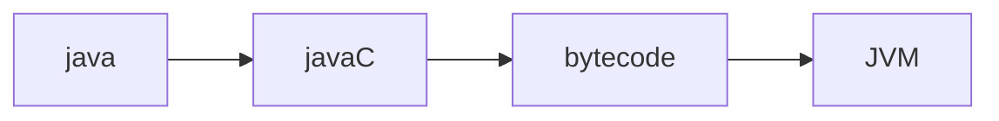
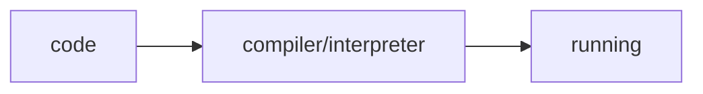
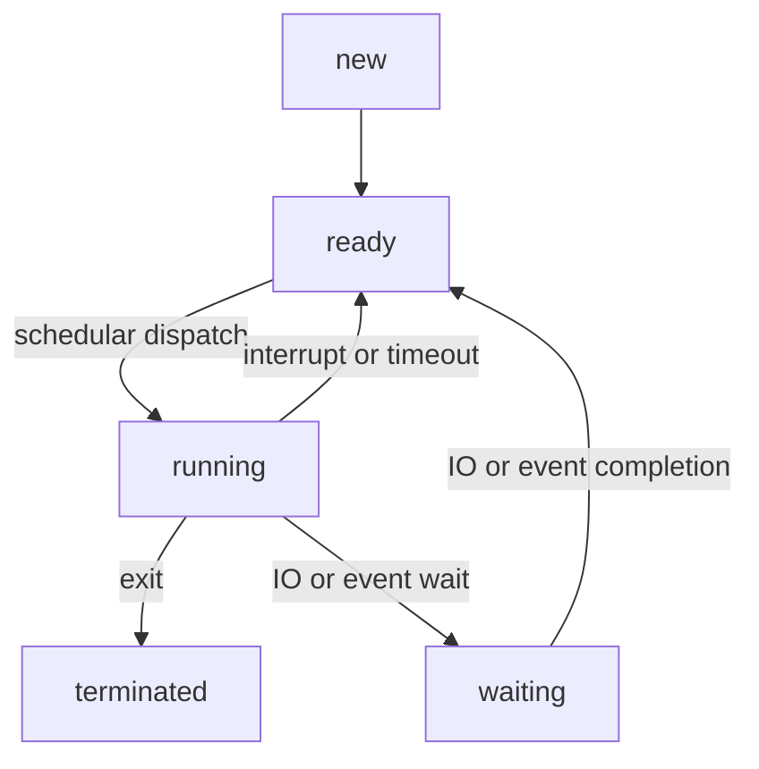
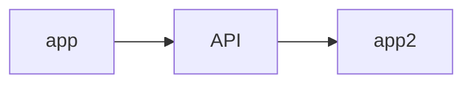
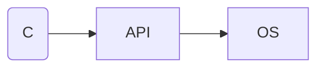
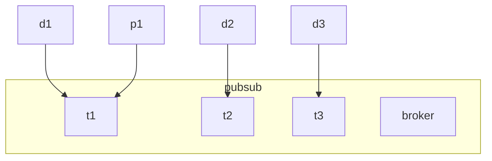

# 1	intro
computer system we can equate it to body parts

brain > CPU
brain > memory
Eyes, Nose > IO devices

harddisk is considered IO device 

2 types of memory
- RAM(Random memory access)
- ROM(Read-only memory)
# 2	computer system
## 2.1	memory
### 2.1.1	RAM
when you turn off the device then the data on RAM then data is deleted
### 2.1.2	ROM
CPU cannot write on it directly. it has to have driver in the middle to write on it
OTA
in CPU bootloader and it is responsible for burning the firmware on the ROM

## 2.2	types of computer
### 2.2.1	general purpose
does more than one task and user can install software that does desired work for user
### 2.2.2	embedded system
Does one task

has microcontroller
which is a module that has:
- CPU
- memory
- IO devices
- other modules
## 2.3	software
in each language there is a way of writing the language called *paradigm*

### 2.3.1	paradigm
- impressive
	- structure
	- oop
- declarative
	- functional
	- sql
	- html
### 2.3.2	types of languages
compass of language types
- static language --- dynamic language: specify data type
- weak language --- strong language: loosly typed language casts datatype at will vs languages that are strict about datatype
while working on dynamic language, you have to unit test always
### 2.3.3	machine language
0101100010101

readable by machine but code for one device is completely unreadable by another device
unreadable by humans

### 2.3.4	assembly
more readable
### 2.3.5	C lang
middle level starts here

code that doesn't depend on hardware

if you change hardware then maybe some of the code is changed but not all of it.

#embedded/interview-question C has full access to RAM but not CPU to access CPU use assembly. Maybe also use assembly to optimize a certain process but this is rare

#### 2.3.5.1	Toolchain
collection of tools that turn c into machine language

we have multiple tool chains. toolchains for windows. for linux. for ARM

![[memory layout in c.excalidraw]]
![[c toolchain.excalidraw | 900]]
turnig source file into .exe is called the **build proces**

header files (.h) are instruction files that explain the presence of functions and extern values (trtrtrtrtrtrjhgfchgf)

### 2.3.6	Java
said that you will create the app one time. pass it through the java c. then it creates bytecode

bytecode is passed into JVM in the client computer.

This means that java apps run on any device

Java is fully compiler and fully interpreted

java is dynamically linked (links libraries in runtime)

#### 2.3.6.1	JDK
has:
- Java C
- debugger
- JRE
#### 2.3.6.2	JRE
has JVM inside and some libraries

### 2.3.7	python
python is as syntax created and implmentation is varied. there are multiple implementation of the language.

This means that the python interpreter is not actually part of the python language.

Cpython actually has a small compiler that checks for syntax error before running and then interpreter checks with techonizer further errors.

Dynamically written

### 2.3.8	javascript
weak and dynamic
### 2.3.9	html
declarative language

if we add conditions + loops to html then it becomes a template
### 2.3.10	nodejs
environment that runs javascript

### 2.3.11	servers
#### 2.3.11.1	apache
connect apache to laptop or pc to make it webserver
#### 2.3.11.2	Database
database connects to server using database url
### 2.3.12	compiler/interpreter

#### 2.3.12.1	compiler
translates source code into machine code and if it finds faults it informs dev of the issue and halts compilation
#### 2.3.12.2	interpreter
as code is run it is interpreted into machine code. if faults are found then running is halted.

#### 2.3.12.3	JIT compiler
code that is repeated a lot is compiled into machine language that is implemented into interpreter to improve performance of interpreter
# 3	operating system
was created so that there is abstraction layer between software and hardware

Does memory management (gives each app a piece of memory reserved for it and it only)
if an app tries to access memory that is not reserved for it then the operating system crashes the app

also access memory under supervision of the operating system

operating system also introduces schedular to organize which program gets priority and when to do time share of CPU time

## 3.1	von neumann
structure of cpu simply
control unit: interprets commands and variables
arithmetic / logic unit: computes data and stores it in AC
register: 
- PC: address that has the turn to execute
- CIR: command to execute
- MDR, MAR: together they store data in certain location in memory
memory unit
input device
output device
bus: data bus, control bus, address bus

## 3.2	BIOS (ROM)
bootstrap is a framework that checks in the hardware and etc.

## 3.3	OS categorization
### 3.3.1	batch OS
1 task finishes it and goes to the next
### 3.3.2	time sharing
shares time between tasks
### 3.3.3	parallel
OS for multiCPU
### 3.3.4	network
for network
### 3.3.5	realtime
OS that takes time constraints and deviations into consideration

## 3.4	OS Caterogriztion (design)
### 3.4.1	monolithic
all operating system in one file with few lines
### 3.4.2	modular
code is split into multiple files
### 3.4.3	microservice based
split OS into multiple features
## 3.5	processor
- hetrogenous and homogenous is when CPUs are similar or different
## 3.6	why OS is important
satisfy multiple requirements for all applications
time on cpu --> abstract suitable scheduling
app require memory --> memory management
app wants different devices --> OS provides different apis to access mouse and keyboard and others
app wants to access files --> OS has directory file system
securely perform duties --> security subsystem, vizualization, control
ease of access and usability --> GUI and shit

## 3.7	process
process: program running

schedular has 3 queues
- ready queue
- job queue: running processes
- waiting queue
### 3.7.1	scheduling criteria #iti/inquire/os

- CPU utilization and execution
- ....
### 3.7.2	thread concepts
it's similar to time sharing but on the process level and is done manually by the developer. Not automatically by the OS due to priorities.

### 3.7.3	life cycle of the process

priority of the process depends on the OS

if the same priority then the schedular does time sharing to share time between processes

interrupt is more important than any process so it stops process so that CPU handles process

if more important process wants time of CPU then old process becomes ready

if we're waiting for IO event to finish we put the process into waiting. Once the IO event is finished then process returns to ready

### 3.7.4	process control block
OS has information on every process that it stores
![[Pasted image 20241111102145.png]]
tasks inside a proces could be working in an infinity loop but still the OS will be able to terminate to transfer them back to ready state according to scheduler

if the schedular swtiches from one process to another due to priority. It will return back to the process at the line it was interrupted on. it will not begin the process from the start.

CPU register is the register that the program was occupying

memory management info are the addresses that the process occupies so that other processes do not interude on the pricess

## 3.8	memory management
memory mangement unit translates virtual addresses into physical addresses in read memory
### 3.8.1	two processes time sharing shared resource
we need method of sharing space called syncronization
### 3.8.2	message passing method
kernal manages space in memory that processes can input messages in that other processes can access the message to recieve it.
# 4	API

webservice = API + internet + rules = RESTFUL API

API Style
- GRPB
- SOAP
- GraphQL
- restful API
MQTT

HTTP client initiates request. server doesn't initiate request

PUBSUB was created to create subscriptions

when p1 publishes to t1

broker sends t1 to d1 as it is subscribed to t1

if d1 is unavailable then t1 is updated until d1 is connected again then it sends update to d1

broker keeps sending probing to d1 making sure it's online

> [!note]
> Mosquito broker
>

> [!note]
> study SOAP, GRPB, GraphQL, restful API

RESTFUL api is a standard that everyone should follow

APIs in operating system is called system calls

# 5	IO subsystem
2 types of handling io devices  in slides page 68

DMA page 71

interrupt handling machanism
- polling or programmed
	- CPU keeps checking for the IO
- interrupt
	- the CPU only acts when the device issues a request

vector table
code that initiated when the interrupt happens is ISR

#iti/inquire/os inquire where does vector table exist?

two types of interrupt. synchronous and asynchronous

- synchronous has a problem of critical section where a variable could be used by more than one thread where it's inproperly acted upon since there was a conflict
	- solved by Mutex which allows 
	- also solved by semaphre
#iti/inquire/os inquire about difference between mutex and semaphore

- deadlock
	- it occures when a task that has mutex or symaphore requires a resource that another process has under symaphore and the other process also requires a resource held by the first process

# 6	file system
directory name space is the folder where everything in the OS branches out

- access control
	- manages who has authority on files
- cleanup: temp files that the OS cleans periodically
- access protection
	- apps are usually in usermode but gets into kernel mode using system call to access devices

- VM is a guest OS that may be the same of different from the underlying host OS
	- advantages in page 99
- Access Control List ~~~~~~

- CLI and GUI
	- CLI under the terminal there is a shell operating
		- in linux `echo $SHELL`

