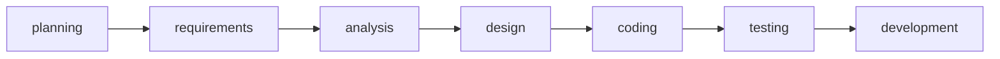

# 1	Fundamentals of testing
[[CH01_TXT01_why testing is necessray.pdf]]
[[CH01_TXT02_what is testing.pdf]]
## 1.1	SW problems
- sw that doesn't work correctly may lead to:
	- loss of money
	- time
	- business reputation
	- life
## 1.2	Nine causes of software bugs
- Faulty requirements definition.
- Client-developer communication failures.
- Deliberate deviations from software requirements.
- Logical design errors.
- Coding errors.
- Non-compliance with documentation and coding instructions.
- Shortcomings of the testing process.
- User interface and procedure errors.
- Documentation errors.
## 1.3	Testing activities
- Planning ,control, **
- Choosing test conditions
- Analysis, Designing and executing test cases **
- Checking results
- Evaluating exit criteria **
- Reporting on the testing process and system under test
- Finalizing or completing closure activities after a test phase has been completed. **
- Testing also includes reviewing documents (including source code) and conducting
static analysis.
### 1.3.1	test planning and control
#### 1.3.1.1	planning
what are the objectives?
- most defects finding
- inform stakeholders of condition of the product
all of these need good documentation
#### 1.3.1.2	control
decviation in plan or not in actual progress
report and take action

### 1.3.2	test analysis and design
#### 1.3.2.1	analysis
review on sources that we will build test cases from
- requirements
- risk analysis report
- structure of the software
- interface specification
evaluate which area can we test (test condition)
#### 1.3.2.2	design
first thing to design is the test cases, which is more important?
test data > output
design environment setup > setup infrustracture and tools
excel sheet called traceability matrix > test conditions + test cases > bi-directional tracability
### 1.3.3	implementation and excecution
#### 1.3.3.1	implementation
implement test cases
develop test procedure
organize test cases
create test suite for related test cases
test data gets created
test harness > create stubs / drivers
verify environment setup
#### 1.3.3.2	execution
manually or using execution tools
ER / AR if not equal called discrepancies
if found record all data and document it
 - tester name
 - date-time of execution
 - actual result
 - test result
 - the test server or device
sometimes called logging or recording
after it we do confirmation testing

we should do regression testing to make sure that bug solved didn't create more bugs

### 1.3.4	exit criterea and reporting
#### 1.3.4.1	exit criterea
if
- 80% of test case execution stop testing
- after finding enough faults
- time out
assess if you need more testing or need further exit criterea

#### 1.3.4.2	reporting
report to stake holders

### 1.3.5	test closure activities
- check planned deliverables
- close reports
- document
- finalize archiving
- handover to maintenance organization
- evaluate how testing went and learn lessons for further work
## 1.4	testing principles
- early testing
- absence of error fallacy: if requirements are wrong then testing won't fix it
- testing shows presence of defects
- testing is context dependent
- defect clustering: focus testing on areas that may incure the most defects
- pesticide paradox: change test cases according to the conditions of code
- exhaustive testing is impossible
## 1.5	psychology of testing
### 1.5.1	independance testing
seperation of testing done by developer and by tester is better than having developer do the entire work.
focus effort
#### 1.5.1.1	levels of independance testing
1. the person who wrote the code is the one to test
2. another person in development team
3. another person in a different department
4. from a different company
### 1.5.2	communication
#### 1.5.2.1	unwanted news
tester brings unwanted news about failures or defects bring gossip about developer being incompetent
testing then seen as destructive
communication should be constructive
#### 1.5.2.2	remind others
 - looking for failures requires:
	 - curiosity
	 - professional pressimistm
	 - critical eye
	 - error guessing professionally
 - defects found save time and money
 - improve developer's skills
#### 1.5.2.3	ways to improve communication
collaboration is better than battles
understand the other's perspective
confirm the other understands and i understand him
don't be personal be professional while cirtisizing 
# 2	Testing througout the SW life cycle
## 2.1	Table of contents
- software development models
- test levels
- test types
- maintenance testing
## 2.2	intro
testing is not decoupled from software development but is integrated in its life cycle
we adhere to models but also we excecute them according to prject requirements

## 2.3	software dev models
- sequential model
- iterative model
- incremental model
### 2.3.1	sequential model
- waterfall
- v-model
#### 2.3.1.1	waterfall model

##### 2.3.1.1.1	advantages
easy
specifiv deliverables
phases are processed and completed 1 at a time
works for smaller priojects
##### 2.3.1.1.2	disadvantages
adjust scope is hard
no working product until late
risk and uncertainty between each phase

#### 2.3.1.2	v-model
![[Pasted image 20241110005138.png]]
##### 2.3.1.2.1	advantages
good for small projects
testing activities before coding starts
saves time
##### 2.3.1.2.2	disavantages
not flexible
not prototyles developed for the project still unti implementation
### 2.3.2	iterative models
- rapid app.
- agile prog.
### 2.3.3	incremental model
combines sequential and iterative
- rad
- rup
- agile development models
### 2.3.4	verification and validation
verification testing and validation testing are in all iterations
#### 2.3.4.1	verfication
if software satisfies requirements or not
#### 2.3.4.2	validation
software meets customer needs or not

## 2.4	test levels
[[CH02_TXT02_Test Levels.pdf]]

## 2.5	test types
### 2.5.1	functional testing: what the system does
- security testing: IO
- interoperability testing: IO
- suitability testing: businesss needs
- accurateness: technical needs
### 2.5.2	non-functional testing
- performance
- load
- stress: overload
- usability: easy to use
- portability: cross platform
- reliability: not be down/crash/problem/
- maintainability: adjust or add feature
### 2.5.3	structure testing

- internal logic is good or not
- code coverage
- could be applied on system / integration / acceptance like business model and menu structure
### 2.5.4	testing related to changes
- confirmation testing: after developer fixes bugs then retesting
- regression testing: testing other modules after developer fixes bug
## 2.6	Maintenance testing
after deploying software we could be required to continue maintenace afterwards for modification and migration or retire system

we regress test on everything

could be done on all testing types and testing levels

impact analysis of modification on system

if specification is subpar or outdated. hard to do maintenance testing
### 2.6.1	modification
if we modify then we need testing for modification
### 2.6.2	migration
needs testing for migration
### 2.6.3	retirement
take everything and archive data
after archiving we test to see if affected and regressions testing

# 3	Static techniques
find problems without running code
to dynamic test:
- main objectives
- interface usability
- design efficiency
- code maturity
regardless, there are things that must be included in static testing
![[Pasted image 20241110012839.png]]
## 3.1	review
find mistakes in files without running code
- informal process
- formal process
we determine which one to pick depending on 2 things
- size of development process
- legal issues
- audit trial

### 3.1.1	activities
#### 3.1.1.1	formal review
![[Pasted image 20241110013546.png]]
##### 3.1.1.1.1	planning
![[Pasted image 20241110013327.png]]
##### 3.1.1.1.2	kickoff meeting
![[Pasted image 20241110013421.png]]
##### 3.1.1.1.3	individual preparation
![[Pasted image 20241110013440.png]]
##### 3.1.1.1.4	review meeting
![[Pasted image 20241110013451.png]]
##### 3.1.1.1.5	rework
![[Pasted image 20241110013504.png]]
##### 3.1.1.1.6	followup
![[Pasted image 20241110013525.png]]
### 3.1.2	roles
![[Pasted image 20241110013750.png]]
### 3.1.3	types
![[Pasted image 20241110013829.png]]

### 3.1.4	success factors for reviews
![[Pasted image 20241110015000.png]]
![[Pasted image 20241110015250.png]]
## 3.2	static analysis
using programs that automatically find faults in code
find:
- inconsistencies
- maintainability of code and design
- prevention of defects
Other issues we find like:
- undefined variable
- calling between modules and components
- variables not used or unreachable/dead code
- missing logic
- programming standard violation
- security violations
- syntax violation of code and software models

# 4	Test design techniques
## 4.1	analysis and design
![[Pasted image 20241110021116.png]]
![[Pasted image 20241110021225.png]]
## 4.2	implementation and execution
![[Pasted image 20241110021504.png]]
![[Pasted image 20241110021523.png]]
## 4.3	Attachments
[[CH04_TXT02_Categories Of Test Design Techniques.pdf]]
[[CH04_TXT03_Specification-based or Black-box Techniques.pdf]]
[[CH04_TXT04_Structure-based or White-box Techniques.pdf]]

## 4.4	experience based technique
skill intuition and experience of the tester. important after formal techniques
### 4.4.1	error guessing
after the tester takes a look at the software. he makesa list of **possible defects** that could affect the code then he tests for these defects one by one
This is called **Fault attack**
### 4.4.2	exploratory testing
this is used when specification is too little or we have to little time. explore the functions of non-functions of the software and based on that decide what to test
document for this is the test charter
Test objective and time-boxes

exploratory testing is concurrent with test design, test execution, test logging and learning

[[CH04_TXT06_Choosing Test Techniques.pdf]]
# 5	Test management
## 5.1	test organization
![[Pasted image 20241110022842.png]]
independent teams or get testers from the development team

depend on developers ------------- testing independent on developers

people can't pick mistakes on their work

![[Pasted image 20241110023031.png]]

project size and complexity / critical systems determine choice from previous choices
![[Pasted image 20241110023316.png]]
independent tester benefit
- new eye
drawback
- isolation
![[Pasted image 20241110023417.png]]
other people could do his role like manager test group, project manager, QA manager
![[Pasted image 20241110023609.png]]
## 5.2	test planning
![[Pasted image 20241110023909.png]]
![[Pasted image 20241110023958.png]]
![[Pasted image 20241110024014.png]]
![[Pasted image 20241110024154.png]]
Test strategy of the organization
- specification and project plan: proactive
- design and coding done: reactive
## 5.3	activities
- scope of testing risks and objectives
- approach: proactive or reactive
- integrate and coordinate test activities in SDLC
- decision what to test
![[Pasted image 20241110024644.png]]
- schedule implementation execution and evailation
![[Pasted image 20241110024722.png]]
![[Pasted image 20241110024933.png]]
adter exit cirteria risk analysis and defect density
![[Pasted image 20241110025322.png]]
test estimation
![[Pasted image 20241110025343.png]]
- matrix based: on projects similar and do similar
- expert based: estimation made by owner or expert on the task
![[Pasted image 20241110025458.png]]
product: quality of specification, test basis, size of product, complexity of problem domain
development: effort depends on the business efficiency and resources
outcome: number of defects

we select approach based on context
if we have risk proactive
skills, objkective, regulation

analytical focuses on most critical module of the software

stochastic testing: statistically which components fail most, random testing
operational profiles: model guides software development to know what is functional and non-functional

methodical testing that relies on the experience of the tester, fault attack and error guessing
![[Pasted image 20241110030156.png]]
## 5.4	monitoring and control
![[Pasted image 20241110030248.png]]
![[Pasted image 20241110030407.png]]
test metrics
- percentage of test cases run and pass or fail
- others as seen below
![[Pasted image 20241110030524.png]]

what is control?

![[Pasted image 20241110030611.png]]
common test control reschedule of testing or increast number of testers or organize which is important or has more priority and which could be skipped

summer report by test managers

![[Pasted image 20241110030817.png]]
![[Pasted image 20241110030826.png]]
## 5.5	configuration management
tool to upload work as developers and testers
![[Pasted image 20241110031114.png]]
![[Pasted image 20241110031155.png]]
trackign for all changes

## 5.6	Project and product risk
adverse event and impact
testing reduce risk
- project risk
- product risk
![[Pasted image 20241110031341.png]]
![[Pasted image 20241110031422.png]]

![[Pasted image 20241110031441.png]]
product risk depends on product deployment software / hardware problems

identification of product risk
![[Pasted image 20241110031730.png]]
![[Pasted image 20241110031754.png]]
## 5.7	incident management
ER / AR discrepancy shouldn't immediately be made a bug

it could just be an incident
![[Pasted image 20241110032041.png]]
![[Pasted image 20241110032208.png]]
incident life cycle
![[Pasted image 20241110032314.png]]
![[Pasted image 20241110032943.png]]
![[Pasted image 20241110032954.png]]
![[Pasted image 20241110033144.png]]
![[Pasted image 20241110033201.png]]
bug review team who say the level of priority of the bug
# 6	Tool support for testing
![[Pasted image 20241110033325.png]]
![[Pasted image 20241110033508.png]]![[Pasted image 20241110033529.png]]
![[Pasted image 20241110033644.png]]![[Pasted image 20241110033803.png]]
![[Pasted image 20241110033950.png]]
![[Pasted image 20241110034019.png]]
![[Pasted image 20241110034036.png]]
![[Pasted image 20241110034125.png]]
![[Pasted image 20241110034146.png]]

## 6.1	attachments
[[CH06_TXT02_Potential Benefits and Risks of Tool.pdf]]
[[CH06_TXT03_Introducing a Tool into an Organization.pdf]]